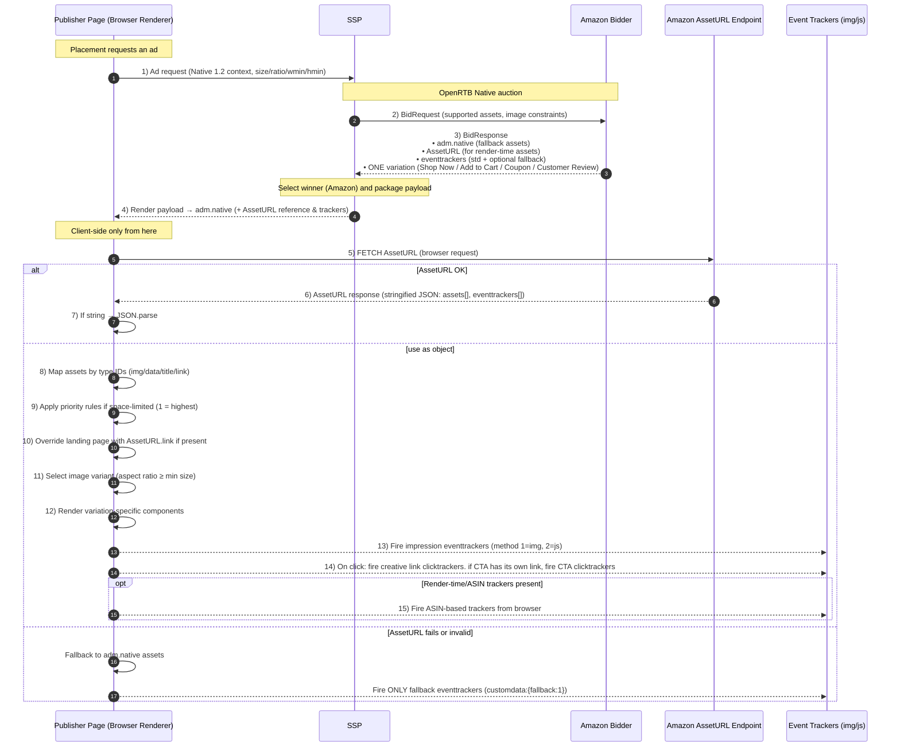

```mermaid
sequenceDiagram
    autonumber
    participant Pub as Publisher Page (Browser Renderer)
    participant SSP as SSP
    participant AMZ as Amazon Bidder
    participant AUS as Amazon AssetURL Endpoint
    participant TRK as Event Trackers (img/js)

    Note over Pub: Placement requests an ad
    Pub->>SSP: 1) Ad request (Native 1.2 context, size/ratio/wmin/hmin)

    Note over SSP,AMZ: OpenRTB Native auction
    SSP->>AMZ: 2) BidRequest (supported assets, image constraints)
    AMZ-->>SSP: 3) BidResponse<br/>• adm.native (fallback assets)<br/>• AssetURL (for render-time assets)<br/>• eventtrackers (std + optional fallback)<br/>• ONE variation (Shop Now / Add to Cart / Coupon / Customer Review)

    Note over SSP: Select winner (Amazon) and package payload
    SSP-->>Pub: 4) Render payload → adm.native (+ AssetURL reference & trackers)

    Note over Pub: Client-side only from here
    Pub->>AUS: 5) FETCH AssetURL (browser request)
    alt AssetURL OK
        AUS-->>Pub: 6) AssetURL response (stringified JSON: assets[], eventtrackers[])
        Pub->>Pub: 7) If string → JSON.parse; else use as object
        Pub->>Pub: 8) Map assets by type IDs (img/data/title/link)
        Pub->>Pub: 9) Apply priority rules if space-limited (1 = highest)
        Pub->>Pub: 10) Override landing page with AssetURL.link if present
        Pub->>Pub: 11) Select image variant (aspect ratio ≥ min size)
        Pub->>Pub: 12) Render variation-specific components
        Pub-->>TRK: 13) Fire impression eventtrackers (method 1=img, 2=js)
        Pub-->>TRK: 14) On click: fire creative link clicktrackers. if CTA has its own link, fire CTA clicktrackers
        opt Render-time/ASIN trackers present
            Pub-->>TRK: 15) Fire ASIN-based trackers from browser
        end
    else AssetURL fails or invalid
        Pub->>Pub: Fallback to adm.native assets
        Pub-->>TRK: Fire ONLY fallback eventtrackers (customdata:{fallback:1})
    end
```
