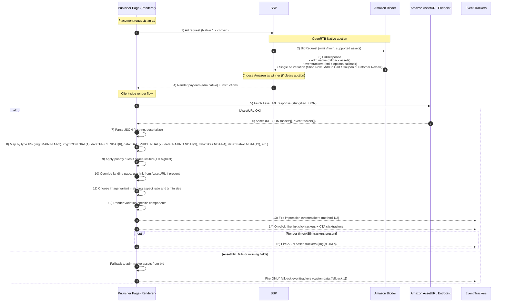

```mermaid
sequenceDiagram
    autonumber
    participant Pub as Publisher Page (Renderer)
    participant SSP as SSP
    participant AMZ as Amazon Bidder
    participant AUS as Amazon AssetURL Endpoint
    participant TRK as Event Trackers

    Note over Pub: Placement requests an ad
    Pub->>SSP: 1) Ad request (Native 1.2 context)

    Note over SSP,AMZ: OpenRTB Native auction
    SSP->>AMZ: 2) BidRequest (wmin/hmin, supported assets)
    AMZ-->>SSP: 3) BidResponse<br/>• adm.native (fallback assets)<br/>• eventtrackers (std + optional fallback)<br/>• Single ad variation (Shop Now / Add to Cart / Coupon / Customer Review)

    Note over SSP: Choose Amazon as winner (if clears auction)
    SSP-->>Pub: 4) Render payload (adm.native) + instructions

    Note over Pub: Client-side render flow
    Pub->>AUS: 5) Fetch AssetURL response (stringified JSON)
    alt AssetURL OK
        AUS-->>Pub: 6) AssetURL JSON (assets[], eventtrackers[])
        Pub->>Pub: 7) Parse JSON (if string, deserialize)
        Pub->>Pub: 8) Map by type IDs (img::MAIN NIAT(3), img::ICON NIAT(1), data::PRICE NDAT(6), data::SALEPRICE NDAT(7), data::RATING NDAT(3), data::likes NDAT(4), data::ctatext NDAT(12), etc.)
        Pub->>Pub: 9) Apply priority rules if space-limited (1 = highest)
        Pub->>Pub: 10) Override landing page: use link from AssetURL if present
        Pub->>Pub: 11) Choose image variant matching aspect ratio and ≥ min size
        Pub->>Pub: 12) Render variation-specific components
        Pub-->>TRK: 13) Fire impression eventtrackers (method 1/2)
        Pub-->>TRK: 14) On click: fire link.clicktrackers + CTA clicktrackers
        opt Render-time/ASIN trackers present
            Pub-->>TRK: 15) Fire ASIN-based trackers (img/js URLs)
        end
    else AssetURL fails or missing fields
        Pub->>Pub: Fallback to adm.native assets from bid
        Pub-->>TRK: Fire ONLY fallback eventtrackers (customdata:{fallback:1})
    end
```
