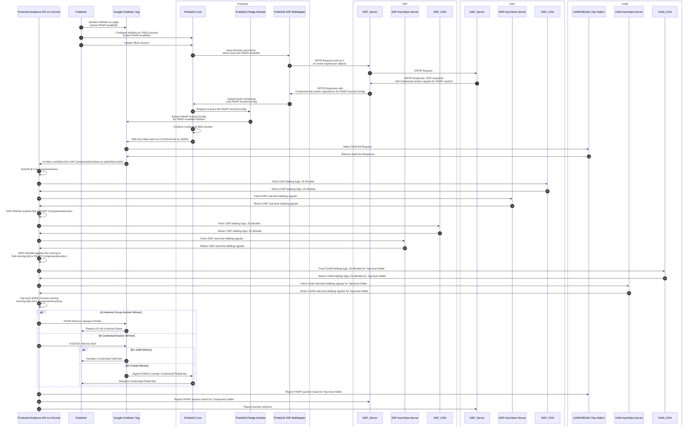

## FLEDGE / PAAPI

```mermaid
sequenceDiagram
    autonumber
    participant FLEDGE as Protected Audience API on Chrome
    participant Pub as Publisher
    participant GPT as Google Publisher Tag
    box PrebidJS
    participant PBJS as PrebidJS Core
    participant PBJS_FLEDGE as PrebidJS Fledge Module
    participant SSP_PBJS as PrebidJS SSP BidAdapter
    end
    box SSP
    participant SSP_Server    
    participant SSP_KV as SSP Key/Value Server
    participant SSP_CDN
    end
    box DSP
    participant DSP_Server    
    participant DSP_KV as DSP Key/Value Server    
    participant DSP_CDN
    end
    box GAM
    participant GAM as GAM/OB/AdX (Top Seller)
    participant GAM_KV as GAM Key/Value Server
    participant GAM_CDN
    end
    

    Pub->>GPT: Declare AdSlots on page <br/> (some PAAPI-enabled)
    Pub->>PBJS: Configure AdSlots for PBJS Auction <br/> (some PAAPI-enabled)
    Pub->>PBJS: Initiate PBJS Auction
    PBJS->>SSP_PBJS: Pass AdUnits and inform <br/> which ones are PAAPI-enabled
    SSP_PBJS->>SSP_Server: ORTB Request with ae:1 <br/> on some impression objects
    SSP_Server->>DSP_Server: ORTB Request
    DSP_Server->>SSP_Server: ORTB Response, DSP responds <br/> with Contextual and/or signals for PAAPI auction
    SSP_Server->>SSP_PBJS: ORTB Response with <br/> Contextual bid and/or ingredients for PAAPI AuctionConfig
    SSP_PBJS->>PBJS: Submit both Contextual <br/> and PAAPI AuctionConfig
    PBJS->>PBJS_FLEDGE: Request to pass the PAAPI AuctionConfig
    PBJS_FLEDGE->>GPT: Submit PAAPI AuctionConfig <br/> for PAAPI enabled AdSlots
    PBJS->>PBJS: Conduct Contextual Bids Auction
    PBJS->>GPT: Add Key-Value pairs for Contxtual bid on AdSlot
    GPT->>GAM: Make GAM Ad Request
    GAM->>GPT: Returns GAM Ad Response
    GPT->>FLEDGE: Invokes runAdAuction with ComponentAuctions as submitted earlier
    FLEDGE->>FLEDGE: Kickoff all ComponentAuctions
    FLEDGE->>DSP_CDN: Fetch DSP bidding logic JS Worklet
    DSP_CDN->>FLEDGE: Return DSP bidding logic JS Worklet
    FLEDGE->>DSP_KV: Fetch DSP real-time bidding signals
    DSP_KV->>FLEDGE: Return DSP real-time bidding signals
    FLEDGE->>FLEDGE: DSP Worklet submits bid in PAAPI ComponenetAuction
    FLEDGE->>SSP_CDN: Fetch SSP bidding logic JS Worklet
    SSP_CDN->>FLEDGE: Return SSP bidding logic JS Worklet
    FLEDGE->>SSP_KV: Fetch SSP real-time bidding signals
    SSP_KV->>FLEDGE: Return SSP real-time bidding signals
    FLEDGE->>FLEDGE: SSPs Worklet applies the scoring to <br/> find winning bid in PAAPI ComponenetAuction
    FLEDGE->>GAM_CDN: Fetch GAM bidding logic JS Worklet for Top-level Seller 
    GAM_CDN->>FLEDGE: Return GAM bidding logic JS Worklet for Top-level Seller 
    FLEDGE->>GAM_KV: Fetch GAM real-time bidding signals for Top-level Seller 
    GAM_KV->>FLEDGE: Return GAM real-time bidding signals for Top-level Seller 
    FLEDGE->>FLEDGE: Top level Seller chooses among <br/> winning bids from ComponentAuctions
    
    alt A Ineterest Group Auction Winner
        FLEDGE->>GPT: PAAPI Returns Opaque Pointer
        GPT->>Pub: Returns IG Ad in fenced frame
    else B Contextual Auction Winner    
        FLEDGE->>GPT: FLEDGE Returns Null
        alt B1 GAM Winner
            GPT->>Pub: Renders Contextual GAM bid
        else B2 Prebid Winner    
            GPT->>PBJS: Signal Prebid to render Contextual Prebid bid
            PBJS->>Pub: Renders Contextual Prebid bid
        end    
    end
    
    FLEDGE->>GAM: Report PAAPI auction result for Top-level Seller
    FLEDGE->>SSP_Server: Report PAAPI auction result for Component Seller
    FLEDGE->>DSP_Server: Report auction win/loss
```
