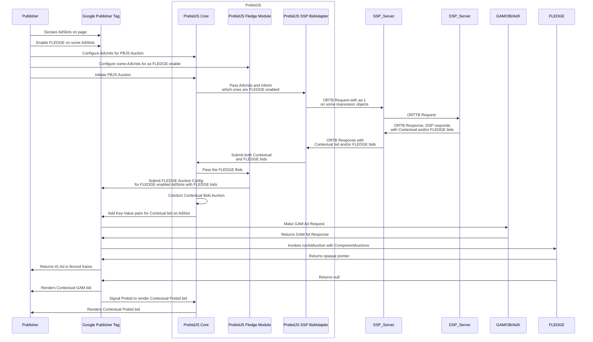

## FLEDGE / PAAPI

```mermaid
sequenceDiagram
    participant Pub as Publisher
    participant GPT as Google Publisher Tag
    box PrebidJS
    participant PBJS as PrebidJS Core
    participant PBJS_FLEDGE as PrebidJS Fledge Module
    participant SSP_PBJS as PrebidJS SSP BidAdapter
    end
    participant SSP_Server
    participant DSP_Server
    participant GAM as GAM/OB/AdX
    Participant FLEDGE

    Pub->>GPT: Declare AdSlots on page
    Pub->>GPT: Enable FLEDGE on some AdSlots
    Pub->>PBJS: Configure AdUnits for PBJS Auction
    Pub->>PBJS_FLEDGE: Configure some AdUnits for as FLEDGE enable
    Pub->>PBJS: Initiate PBJS Auction
    PBJS->>SSP_PBJS: Pass AdUnits and inform <br/> which ones are FLEDGE enabled
    SSP_PBJS->>SSP_Server: ORTB Request with ae:1 <br/>  on some impression objects
    SSP_Server->>DSP_Server: ORTTB Request
    DSP_Server->>SSP_Server: ORTB Response, DSP responds <br/> with Contextual and/or FLEDGE bids
    SSP_Server->>SSP_PBJS: ORTB Response with <br/> Contextual bid and/or FLEDGE bids
    SSP_PBJS->>PBJS: Submit both Contextual <br/> and FLEDGE bids
    PBJS->>PBJS_FLEDGE: Pass the FLEDGE Bids
    PBJS_FLEDGE->>GPT: Submit FLEDGE Auction Config <br/> for FLEDGE enabled AdSlots with FLEDGE bids
    PBJS->>PBJS: Conduct Contextual Bids Auction
    PBJS->>GPT: Add Key-Value pairs for Contxtual bid on AdSlot
    GPT->>GAM: Make GAM Ad Request
    GAM->>GPT: Returns GAM Ad Response
    GPT->>FLEDGE: Invokes runAdAuction with ComponentAuctions
    FLEDGE->>GPT: Returns opaque pointer
    GPT->>Pub: Returns IG Ad in fenced frame
    FLEDGE->>GPT: Returns null
    GPT->>Pub: Renders Contextual GAM bid
    GPT->>PBJS: Signal Prebid to render Contextual Prebid bid
    PBJS->>Pub: Renders Contextual Prebid bid
```
