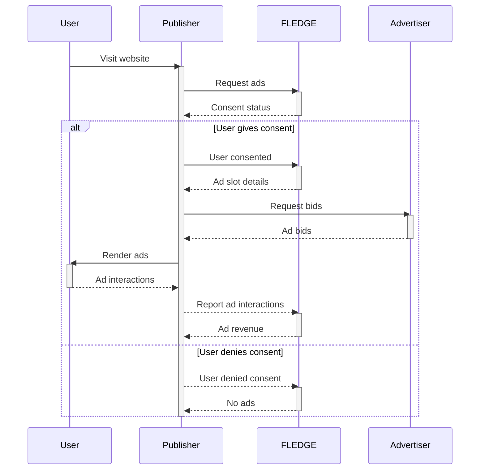

## FLEDGE / PAAPI

```mermaid
sequenceDiagram
    participant User
    participant Publisher
    participant FLEDGE
    participant Advertiser

    User->>Publisher: Visit website
    activate Publisher

    Publisher->>FLEDGE: Request ads
    activate FLEDGE

    FLEDGE-->>Publisher: Consent status
    deactivate FLEDGE

    alt User gives consent
        Publisher->>FLEDGE: User consented
        activate FLEDGE

        FLEDGE-->>Publisher: Ad slot details
        deactivate FLEDGE

        Publisher->>Advertiser: Request bids
        activate Advertiser

        Advertiser-->>Publisher: Ad bids
        deactivate Advertiser

        Publisher->>User: Render ads
        activate User

        User-->>Publisher: Ad interactions
        deactivate User

        Publisher-->>FLEDGE: Report ad interactions
        activate FLEDGE

        FLEDGE-->>Publisher: Ad revenue
        deactivate FLEDGE

    else User denies consent
        Publisher-->>FLEDGE: User denied consent
        activate FLEDGE

        FLEDGE-->>Publisher: No ads
        deactivate FLEDGE
    end

    deactivate Publisher
```
