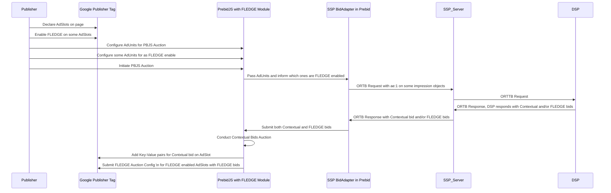

## FLEDGE / PAAPI

```mermaid
sequenceDiagram
    participant Pub as Publisher
    participant GPT as Google Publisher Tag
    participant PBJS as PrebidJS with FLEDGE Module
    participant SSP_PBJS as SSP BidAdapter in Prebid
    participant SSP_Server
    participant DSP

    Pub->>GPT: Declare AdSlots on page
    Pub->>GPT: Enable FLEDGE on some AdSlots
    Pub->>PBJS: Configure AdUnits for PBJS Auction
    Pub->>PBJS: Configure some AdUnits for as FLEDGE enable
    Pub->>PBJS: Initiate PBJS Auction
    PBJS->>SSP_PBJS: Pass AdUnits and inform which ones are FLEDGE enabled
    SSP_PBJS->>SSP_Server: ORTB Request with ae:1 on some impression objects
    SSP_Server->>DSP: ORTTB Request
    DSP->>SSP_Server: ORTB Response, DSP responds with Contextual and/or FLEDGE bids
    SSP_Server->>SSP_PBJS: ORTB Response with Contextual bid and/or FLEDGE bids
    SSP_PBJS->>PBJS: Submit both Contextual and FLEDGE bids
    PBJS->>PBJS: Conduct Contextual Bids Auction
    PBJS->>GPT: Add Key-Value pairs for Contxtual bid on AdSlot
    PBJS->>GPT: Submit FLEDGE Auction Config \n for FLEDGE enabled AdSlots with FLEDGE bids
    
    

    
```
