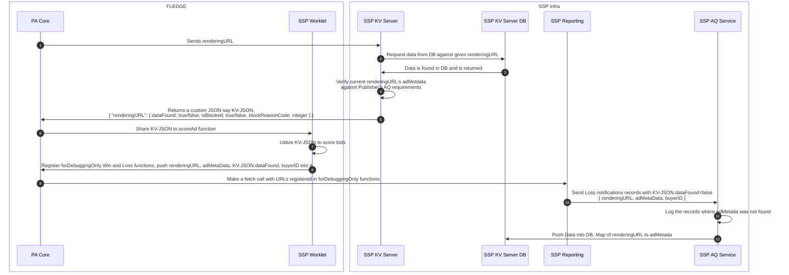

# Ad Quality in Protected Audience

```mermaid
sequenceDiagram
    autonumber
    box FLEDGE
    participant PACore as PA Core
    participant SSPW as SSP Worklet
    end
    box SSP Infra
    participant SSPKV as SSP KV Server
    participant SSPKVDB as SSP KV Server DB
    participant SSPRE as SSP Reporting
    participant SSPAQ as SSP AQ Service
    end

    PACore->>SSPKV: Sends renderingURL
    SSPKV->>SSPKVDB: Request data from DB against given renderingURL
    SSPKVDB->>SSPKV: Data is found in DB and is returned
    SSPKV->>SSPKV: Verify current renderingURL's adMetdata <br/> against Publisher's AQ requirements
    SSPKV->>PACore: Returns a custom JSON say KV-JSON. <br/> { "renderingURL": { dataFound: true/false, isBlocked: true/false, blockReasonCode: integer } }
    PACore->>SSPW: Share KV-JSON to scoreAd function
    SSPW->>SSPW: Utilize KV-JSON to score bids
    SSPW->>PACore: Register forDebuggingOnly Win and Loss functions, push renderingURL, adMetaData, KV-JSON.dataFound, buyerID  into it
    PACore->>SSPRE: Make a fetch call with URLs registered in forDebuggingOnly functions
    SSPRE->>SSPAQ: Send Loss notifications records with KV-JSON.dataFound=false <br/> { renderingURL, adMetaData, buyerID }
    SSPAQ->>SSPAQ: Log the records where adMetada was not found 
    SSPAQ->>SSPKVDB: Push Data into DB, Map of renderingURL to adMetada
```
