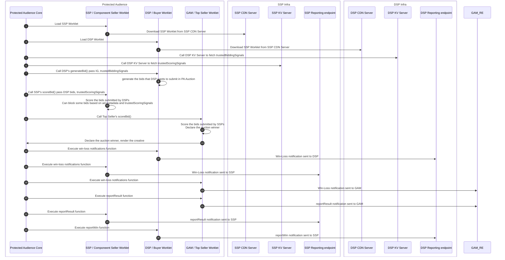

# Protected Audience Auction

```mermaid
sequenceDiagram
    autonumber
    box Protected Audience
    participant PA as Protected Audience Core
    participant SSP_Worklet as SSP / Componeent Seller Worklet
    participant DSP_Worklet as DSP / Buyer Worklet
    participant GAM_Worklet as GAM / Top Seller Worklet 
    end
    box SSP Infra
    participant SSP_CDN as SSP CDN Server
    participant SSP_KV as SSP KV Server
    participant SSP_RE as SSP Reporting endpoint
    end
    box DSP Infra
    participant DSP_CDN as DSP CDN Server
    participant DSP_KV as DSP KV Server
    participant DSP_RE as DSP Reporting endpoint
    end

    PA->>SSP_Worklet: Load SSP Worklet
    SSP_Worklet->>SSP_CDN: Download SSP Worklet from SSP CDN Server
    PA->>DSP_Worklet: Load DSP Worklet
    DSP_Worklet->>DSP_CDN: Download SSP Worklet from SSP CDN Server
    PA->>DSP_KV: Call DSP KV Server to fetch trustedBiddingSignals
    PA->>SSP_KV: Call DSP KV Server to fetch trustedScoringSignals
    PA->>DSP_Worklet: Call DSP's generateBid() pass IG, trustedBiddingSignals
    DSP_Worklet->>DSP_Worklet: generate the bids that DSP wants to submit in PA Auction
    PA->>SSP_Worklet: Call SSP's scoreBid() pass DSP bids, trustedScoringSignals
    SSP_Worklet->>SSP_Worklet: Score the bids submitted by DSPs <br/> Can block some bids based on ad-metadata and trustedScoringSignals
    PA->>GAM_Worklet: Call Top Seller's scoreBid()
    GAM_Worklet->>GAM_Worklet: Score the bids submitted by SSPs <br/> Declare the auction winner
    GAM_Worklet->>PA: Declare the auction winner, render the creative
    PA->>DSP_Worklet: Execute win-loss notifications function
    DSP_Worklet->>DSP_RE: Win-Loss notification sent to DSP
    PA->>SSP_Worklet: Execute win-loss notifications function
    SSP_Worklet->>SSP_RE: Win-Loss notification sent to SSP
    PA->>GAM_Worklet: Execute win-loss notifications function
    GAM_Worklet->>GAM_RE: Win-Loss notification sent to GAM
    PA->>GAM_Worklet: Execute reportResult function
    GAM_Worklet->>GAM_RE: reportResult notification sent to GAM
    PA->>SSP_Worklet: Execute reportResult function
    SSP_Worklet->>SSP_RE: reportResult notification sent to SSP
    PA->>DSP_Worklet: Execute reportWin function
    DSP_Worklet->>DSP_RE: reportWin notification sent to SSP
```
