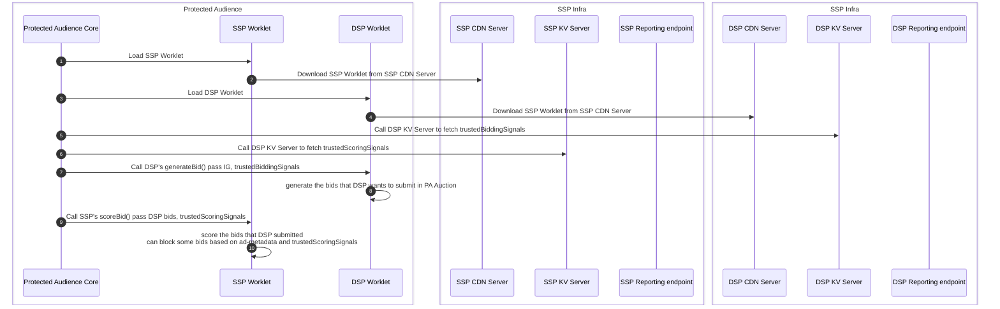

# Protected Audience Auction

```mermaid
sequenceDiagram
    autonumber
    box Protected Audience
    participant PA as Protected Audience Core
    participant SSP_Worklet as SSP Worklet
    participant DSP_Worklet as DSP Worklet    
    end
    box SSP Infra
    participant SSP_CDN as SSP CDN Server
    participant SSP_KV as SSP KV Server
    participant SSP_RE as SSP Reporting endpoint
    end
    box SSP Infra
    participant DSP_CDN as DSP CDN Server
    participant DSP_KV as DSP KV Server
    participant DSP_RE as DSP Reporting endpoint
    end

    PA->>SSP_Worklet: Load SSP Worklet
    SSP_Worklet->>SSP_CDN: Download SSP Worklet from SSP CDN Server
    PA->>DSP_Worklet: Load DSP Worklet
    DSP_Worklet->>DSP_CDN: Download SSP Worklet from SSP CDN Server
    PA->>DSP_KV: Call DSP KV Server to fetch trustedBiddingSignals
    PA->>SSP_KV: Call DSP KV Server to fetch trustedScoringSignals
    PA->>DSP_Worklet: Call DSP's generateBid() pass IG, trustedBiddingSignals
    DSP_Worklet->>DSP_Worklet: generate the bids that DSP wants to submit in PA Auction
    PA->>SSP_Worklet: Call SSP's scoreBid() pass DSP bids, trustedScoringSignals
    SSP_Worklet->>SSP_Worklet: score the bids that DSP submitted <br/> can block some bids based on ad-metadata and trustedScoringSignals
    
    

    
```
