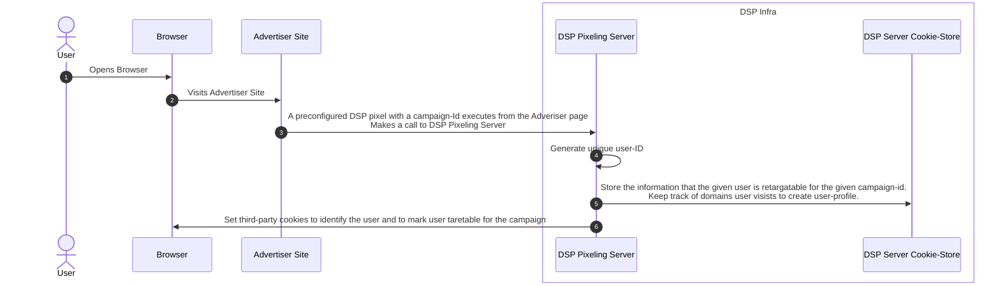
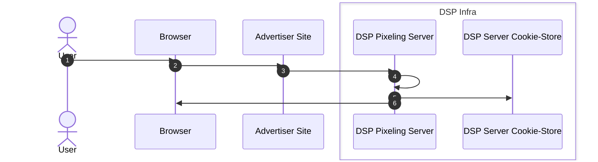
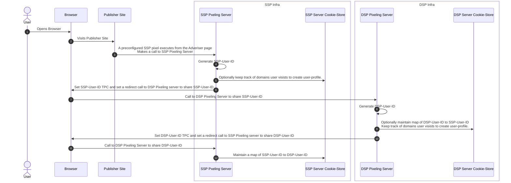
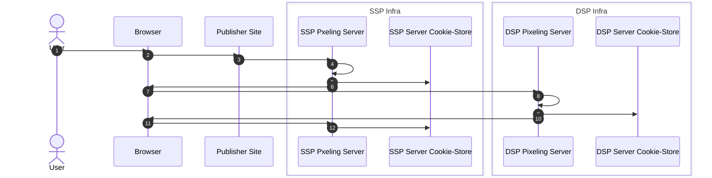
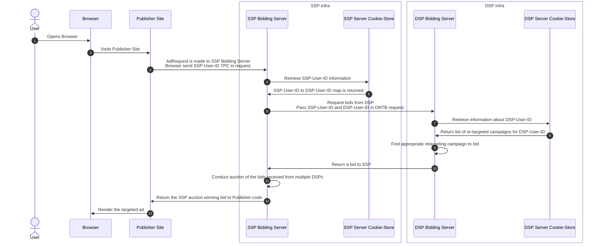
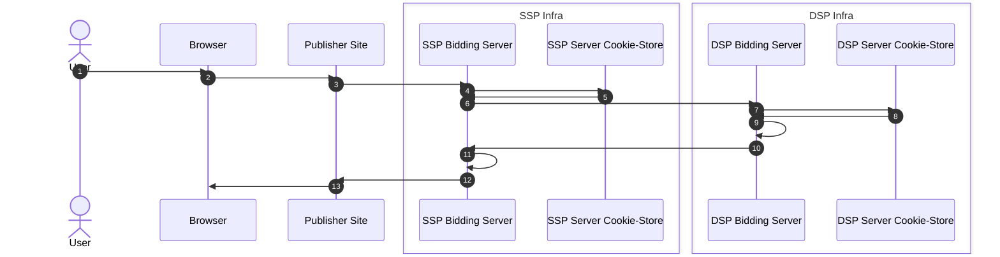

# Buyers / DSPs aquiring users from Advertiser sites to retarget

```mermaid
sequenceDiagram
    autonumber
    actor User
    participant Browser
    participant Adv as Advertiser Site
    box DSP Infra
    participant DSP_pix as DSP Pixeling Server
    participant DSP_db as DSP Server Cookie-Store
    end

    User->>Browser: Opens Browser
    Browser->>Adv: Visits Advertiser Site
    Adv->>DSP_pix: A preconfigured DSP pixel with a campaign-Id executes from the Adveriser page  <br/> Makes a call to DSP Pixeling Server
    DSP_pix->>DSP_pix: Generate unique user-ID
    DSP_pix->>DSP_db: Store the information that the given user is retargatable for the given campaign-id. <br/> Keep track of domains user visists to create user-profile.
    DSP_pix->>Browser: Set third-party cookies to identify the user and to mark user taretable for the campaign
```

```mermaid
sequenceDiagram
    autonumber
    actor User
    participant Browser
    participant Adv as Advertiser Site
    box DSP Infra
    participant DSP_pix as DSP Pixeling Server
    participant DSP_db as DSP Server Cookie-Store
    end

    User->>Browser: 
    Browser->>Adv: 
    Adv->>DSP_pix: 
    DSP_pix->>DSP_pix: 
    DSP_pix->>DSP_db: 
    DSP_pix->>Browser: 
```

# User sync between SSP and DSP on Publisher site

```mermaid
sequenceDiagram
    autonumber
    actor User
    participant Browser
    participant Pub as Publisher Site
    box SSP Infra
    participant SSP_pix as SSP Pxeling Server
    participant SSP_db as SSP Server Cookie-Store
    end
    box DSP Infra
    participant DSP_pix as DSP Pixeling Server
    participant DSP_db as DSP Server Cookie-Store
    end

    User->>Browser: Opens Browser
    Browser->>Pub: Visits Publisher Site
    Pub->>SSP_pix: A preconfigured SSP pixel executes from the Adveriser page  <br/> Makes a call to SSP Pixeling Server
    SSP_pix->>SSP_pix: Generate SSP-User-ID
    SSP_pix->>SSP_db: Optionally keep track of domains user visists to create user-profile.
    SSP_pix->>Browser: Set SSP-User-ID TPC and set a redirect call to DSP Pixeling server to share SSP-User-ID
    Browser->>DSP_pix: Call to DSP Pixeling Server to share SSP-User-ID
    DSP_pix->>DSP_pix: Generate DSP-User-ID
    DSP_pix->>DSP_db: Optionally maintain map of DSP-User-ID to SSP-User-ID <br/> Keep track of domains user visists to create user-profile. 
    DSP_pix->>Browser: Set DSP-User-ID TPC and set a redirect call to SSP Pixeling server to share DSP-User-ID
    Browser->>SSP_pix: Call to DSP Pixeling Server to share DSP-User-ID
    SSP_pix->>SSP_db: Maintain a map of SSP-User-ID to DSP-User-ID
```

```mermaid
sequenceDiagram
    autonumber
    actor User
    participant Browser
    participant Pub as Publisher Site
    box SSP Infra
    participant SSP_pix as SSP Pxeling Server
    participant SSP_db as SSP Server Cookie-Store
    end
    box DSP Infra
    participant DSP_pix as DSP Pixeling Server
    participant DSP_db as DSP Server Cookie-Store
    end

    User->>Browser: 
    Browser->>Pub: 
    Pub->>SSP_pix: 
    SSP_pix->>SSP_pix: 
    SSP_pix->>SSP_db: 
    SSP_pix->>Browser: 
    Browser->>DSP_pix: 
    DSP_pix->>DSP_pix: 
    DSP_pix->>DSP_db: 
    DSP_pix->>Browser: 
    Browser->>SSP_pix: 
    SSP_pix->>SSP_db: 
```

# Displaying Retargeted Ads on Publisher web-sites

```mermaid
sequenceDiagram
    autonumber
    actor User
    participant Browser
    participant Pub as Publisher Site
    box SSP Infra
    participant SSP_bid as SSP Bidding Server
    participant SSP_db as SSP Server Cookie-Store
    end
    box DSP Infra
    participant DSP_bid as DSP Bidding Server
    participant DSP_db as DSP Server Cookie-Store
    end

    User->>Browser: Opens Browser
    Browser->>Pub: Visits Publisher Site
    Pub->>SSP_bid: AdRequest is made to SSP Bidding Server <br/> Browser send SSP-User-ID TPC in request.
    SSP_bid->>SSP_db: Retrieve SSP-User-ID information
    SSP_db->>SSP_bid: SSP-User-ID to DSP-User-ID map is returned
    SSP_bid->>DSP_bid: Request bids from DSP <br/> Pass SSP-User-ID and DSP-User-ID in ORTB request.
    DSP_bid->>DSP_db: Retrieve information about DSP-User-ID
    DSP_db->>DSP_bid: Return list of re-targeted campaigns for DSP-User-ID
    DSP_bid->>DSP_bid: Find appropriate retargeting campaign to bid
    DSP_bid->>SSP_bid: Return a bid to SSP
    SSP_bid->>SSP_bid: Conduct auction of the bids received from multiple DSPs
    SSP_bid->>Pub: Return the SSP auction winning bid to Publisher code
    Pub->>Browser: Render the targeted ad    
```

```mermaid
sequenceDiagram
    autonumber
    actor User
    participant Browser
    participant Pub as Publisher Site
    box SSP Infra
    participant SSP_bid as SSP Bidding Server
    participant SSP_db as SSP Server Cookie-Store
    end
    box DSP Infra
    participant DSP_bid as DSP Bidding Server
    participant DSP_db as DSP Server Cookie-Store
    end

    User->>Browser: 
    Browser->>Pub: 
    Pub->>SSP_bid: 
    SSP_bid->>SSP_db: 
    SSP_db->>SSP_bid: 
    SSP_bid->>DSP_bid: 
    DSP_bid->>DSP_db: 
    DSP_db->>DSP_bid: 
    DSP_bid->>DSP_bid: 
    DSP_bid->>SSP_bid: 
    SSP_bid->>SSP_bid: 
    SSP_bid->>Pub: 
    Pub->>Browser: 
```

