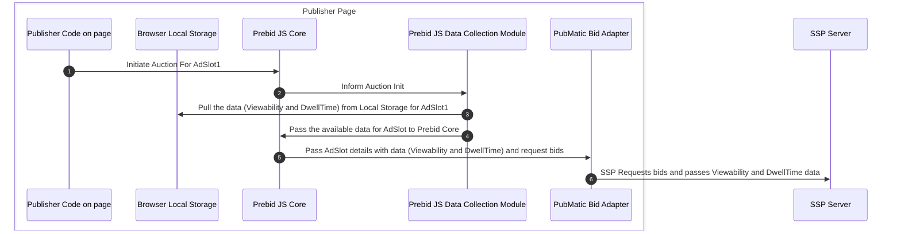

# Inventory Packaging
We have to collect the ad-slot viewability and dwell time information and use it on the server side to put the inventory in different buckets.

## Current Approach: Client-Side Data Storage

