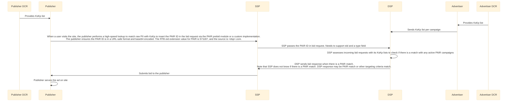

```mermaid
%%{init: {'theme': 'base', 'themeVariables': { 'participantBkgColor': '#f0f0f0', 'participantBorderColor': '#000000' }}}%%
sequenceDiagram

participant PC as Publisher DCR
participant Pub as Publisher
participant SSP
participant DSP
participant Adv as Advertiser
participant AC as Advertiser DCR

PC->>Pub: Provides KsKp list
AC->>Adv: Provides KsKp list
Adv->>DSP: Sends KsKp list per campaign

Pub->>SSP: When a user visits the site, the publisher performs a high-speed lookup to match raw PII with KsKp to insert the PAIR ID in the bid request via the PAIR prebid module or a custom implementation.<br/>The publisher ensures the PAIR ID is in a URL-safe format and base64 encoded. The RTB eid extension value for PAIR is 571187, and the source is <dsp>.com.

SSP->>DSP: SSP passes the PAIR ID in bid request. Needs to support eid and a type field
DSP->>DSP: DSP assesses incoming bid requests with its KsKp lists to check if there is a match with any active PAIR campaigns
DSP->>SSP: DSP sends bid response when there is a PAIR match.<br/>Note that SSP does not know if there is a PAIR match. DSP response may be PAIR match or other targeting criteria match.

SSP->>Pub: Submits bid to the publisher
Pub->>Pub: Publisher serves the ad on site

```
