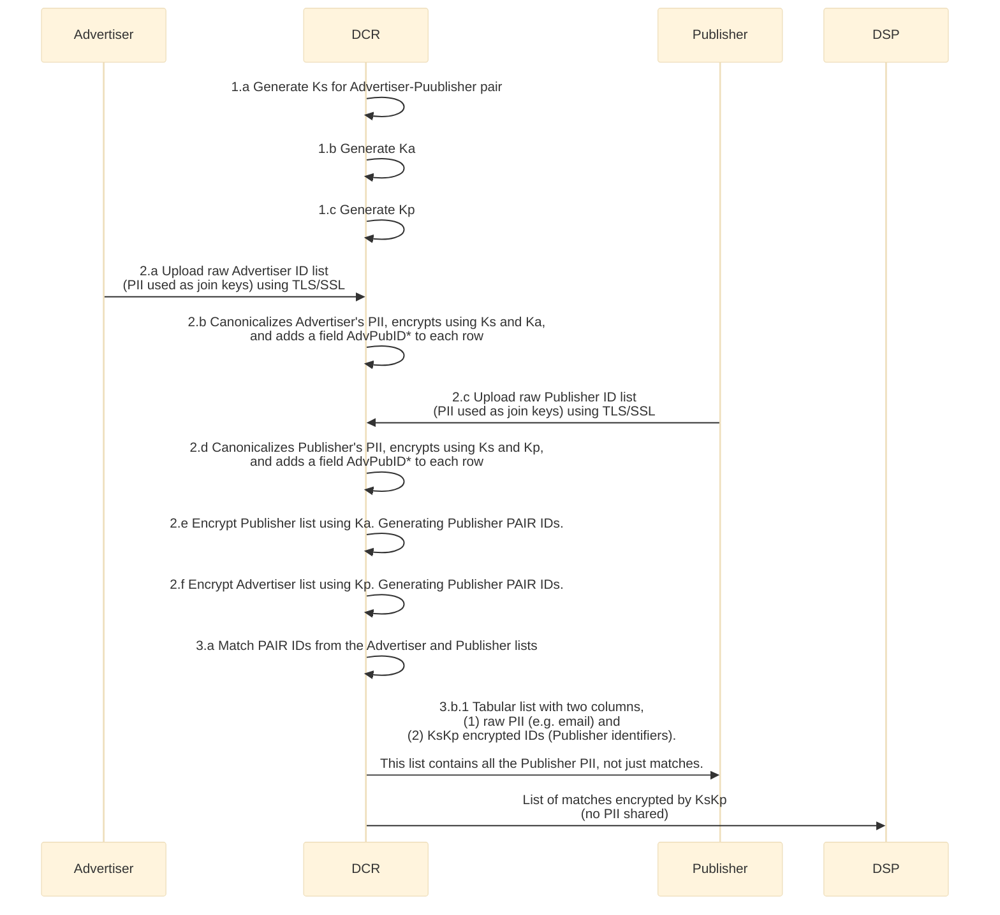

```mermaid
%%{init: {'theme': 'base', 'themeVariables': { 'participantBkgColor': '#f0f0f0', 'participantBorderColor': '#000000' }}}%%
sequenceDiagram

participant Adv as Advertiser
participant DCR
participant Pub as Publisher
participant DSP

DCR->>DCR: 1.a Generate Ks for Advertiser-Puublisher pair
DCR->>DCR: 1.b Generate Ka
DCR->>DCR: 1.c Generate Kp

Adv->>DCR: 2.a Upload raw Advertiser ID list <br/>(PII used as join keys) using TLS/SSL
DCR->>DCR: 2.b Canonicalizes Advertiser's PII, encrypts using Ks and Ka,<br/> and adds a field AdvPubID* to each row
Pub->>DCR: 2.c Upload raw Publisher ID list <br/>(PII used as join keys) using TLS/SSL
DCR->>DCR: 2.d Canonicalizes Publisher's PII, encrypts using Ks and Kp,<br/> and adds a field AdvPubID* to each row
DCR->>DCR: 2.e Encrypt Publisher list using Ka. Generating Publisher PAIR IDs.
DCR->>DCR: 2.f Encrypt Advertiser list using Kp. Generating Publisher PAIR IDs.

DCR->>DCR: 3.a Match PAIR IDs from the Advertiser and Publisher lists
DCR->>Pub: 3.b.1 Tabular list with two columns, <br/>(1) raw PII (e.g. email) and <br/>(2) KsKp encrypted IDs (Publisher identifiers).<br/><br/>This list contains all the Publisher PII, not just matches.
DCR->>DSP: List of matches encrypted by KsKp <br/>(no PII shared)

```
