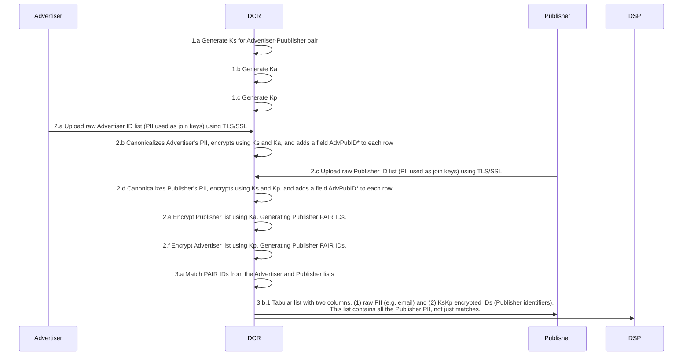

AC->>PC: 2.c AC shares KsKa-encrypted Advertiser list w/ AdvPubID with PC
PC->>AC: 2.d PC shares KsKp-encrypted Publisher list w/ AdvPubID with AC
AC->>AC: 2.e AC encrypts list from 2.d using Ka
PC->>PC: 2.f PC encrypts list from 2.c using Kp
PC->>AC: 2.g PC shares a list that contains all AdvPubIDs and PAIR iDs with AC
AC->>PC: 2.h AC shares the whole PAIR ID list with PC ( i.e. list created in 2.e)

PC->>PC: 3.a PC matches PAIR IDs from step 2.f and 2.h
AC->>AC: 3.b AC matches PAIR IDs from step 2.e and 2.g
PC->>Pub: 3.c Tabular list with two columns, (1) raw PII (e.g. email and (2) KsKp encrypted IDs. This list contains all the Publisher PII not just matches.
AC->>AC: 3.d Decrypt PAIR IDs matched in 3.b by removing the Ka key to get KsKp iDs.
AC->>DSP: 3.e List of matches encrypted by KsKp (no PII)
