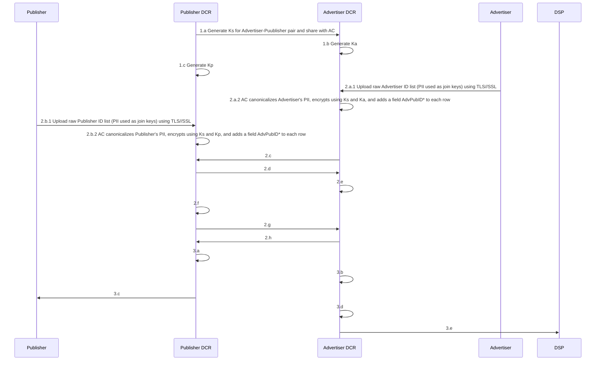

```mermaid
sequenceDiagram

participant Pub as Publisher
participant PC as Publisher DCR
participant AC as Advertiser DCR
participant Adv as Advertiser
participant DSP

PC->>AC: 1.a Generate Ks for Advertiser-Puublisher pair and share with AC
AC->>AC: 1.b Generate Ka
PC->>PC: 1.c Generate Kp

Adv->>AC: 2.a.1 Upload raw Advertiser ID list (PII used as join keys) using TLS//SSL
AC->>AC: 2.a.2 AC canonicalizes Advertiser's PII, encrypts using Ks and Ka, and adds a field AdvPubID* to each row

Pub->>PC: 2.b.1 Upload raw Publisher ID list (PII used as join keys) using TLS//SSL
PC->>PC: 2.b.2 AC canonicalizes Publisher's PII, encrypts using Ks and Kp, and adds a field AdvPubID* to each row

AC->>PC: 2.c
PC->>AC: 2.d
AC->>AC: 2.e
PC->>PC: 2.f
PC->>AC: 2.g
AC->>PC: 2.h

PC->>PC: 3.a
AC->>AC: 3.b
PC->>Pub: 3.c
AC->>AC: 3.d
AC->>DSP: 3.e

```
