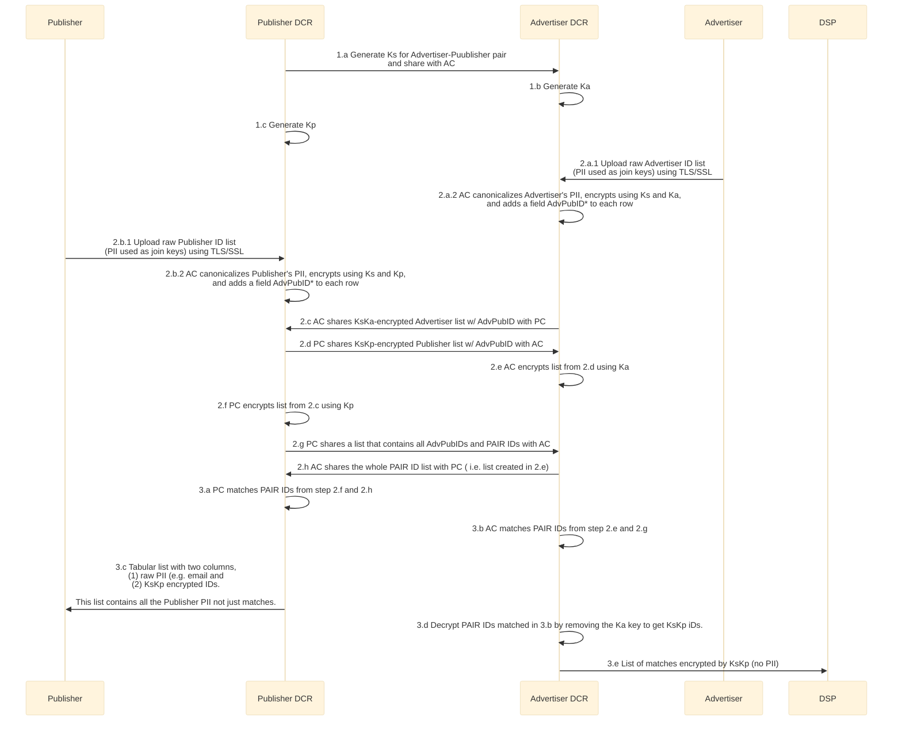

```mermaid
%%{init: {'theme': 'base', 'themeVariables': { 'participantBkgColor': '#f0f0f0', 'participantBorderColor': '#000000' }}}%%
sequenceDiagram

participant Pub as Publisher
participant PC as Publisher DCR
participant AC as Advertiser DCR
participant Adv as Advertiser
participant DSP

PC->>AC: 1.a Generate Ks for Advertiser-Puublisher pair <br/>and share with AC
AC->>AC: 1.b Generate Ka
PC->>PC: 1.c Generate Kp

Adv->>AC: 2.a.1 Upload raw Advertiser ID list <br/>(PII used as join keys) using TLS/SSL
AC->>AC: 2.a.2 AC canonicalizes Advertiser's PII, encrypts using Ks and Ka,<br/> and adds a field AdvPubID* to each row

Pub->>PC: 2.b.1 Upload raw Publisher ID list <br/>(PII used as join keys) using TLS/SSL
PC->>PC: 2.b.2 AC canonicalizes Publisher's PII, encrypts using Ks and Kp,<br/> and adds a field AdvPubID* to each row

AC->>PC: 2.c AC shares KsKa-encrypted Advertiser list w/ AdvPubID with PC
PC->>AC: 2.d PC shares KsKp-encrypted Publisher list w/ AdvPubID with AC
AC->>AC: 2.e AC encrypts list from 2.d using Ka
PC->>PC: 2.f PC encrypts list from 2.c using Kp
PC->>AC: 2.g PC shares a list that contains all AdvPubIDs and PAIR IDs with AC
AC->>PC: 2.h AC shares the whole PAIR ID list with PC ( i.e. list created in 2.e)

PC->>PC: 3.a PC matches PAIR IDs from step 2.f and 2.h
AC->>AC: 3.b AC matches PAIR IDs from step 2.e and 2.g
PC->>Pub: 3.c Tabular list with two columns, <br/>(1) raw PII (e.g. email and <br/>(2) KsKp encrypted IDs. <br/><br/>This list contains all the Publisher PII not just matches.
AC->>AC: 3.d Decrypt PAIR IDs matched in 3.b by removing the Ka key to get KsKp iDs.
AC->>DSP: 3.e List of matches encrypted by KsKp (no PII)

```
