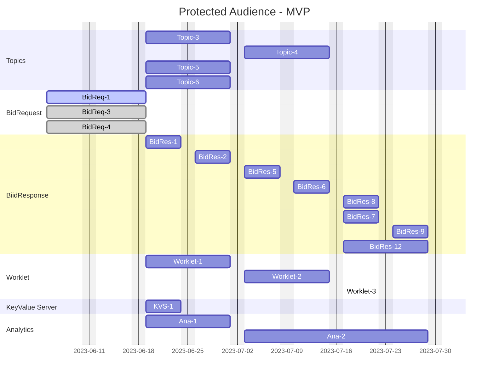

```mermaid
gantt
    dateFormat  YYYY-MM-DD
    title       Protected Audience - MVP
    excludes    weekends
    %% (`excludes` accepts specific dates in YYYY-MM-DD format, days of the week ("sunday") or "weekends", but not the word "weekdays".)

    section Topics
    Topic-3               :  des2, 2023-06-19, 10d
    Topic-4               :         des3, after des2, 10d
    Topic-5              :         des4, 2023-06-19, 10d
    Topic-6              :         des4, 2023-06-19, 10d

    section BidRequest
    BidReq-1               :active,  t1, 2023-06-05,2023-06-19
    BidReq-3               :done,  t2, 2023-06-05,2023-06-19
    BidReq-4               :done,  t3, 2023-06-05,2023-06-19
    

    section BiidResponse
    BidRes-1               : r1, 2023-06-19, 5d
    BidRes-2               : r2, after r1, 5d
    BidRes-5               : r3, after r2, 5d
    BidRes-6               : r4, after r3, 5d
    BidRes-8               : r5, after r4, 5d
    BidRes-7               : r6, after r4, 5d
    BidRes-9               : r8, after r6, 5d
    BidRes-12               : r9, after r4, 10d
    
    section Worklet
    Worklet-1               :  w1, 2023-06-19, 10d
    Worklet-2               :  w2, after w1, 10d
    Worklet-3               :  w3, after w2, 10
    
    section KeyValue Server    
    KVS-1               :  k1, 2023-06-19, 5d
    
    section Auctin Config Signals
    

    section Analytics
    Ana-1               :  a1, 2023-06-19, 10d
    Ana-2               :  a2, after a1, 20d
    
```
