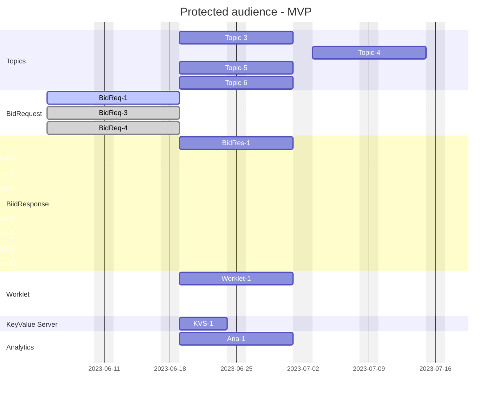

```mermaid
gantt
    dateFormat  YYYY-MM-DD
    title       Protected audience - MVP
    excludes    weekends
    %% (`excludes` accepts specific dates in YYYY-MM-DD format, days of the week ("sunday") or "weekends", but not the word "weekdays".)

    section Topics
    Topic-3               :  des2, 2023-06-19, 10d
    Topic-4               :         des3, after des2, 10d
    Topic-5              :         des4, 2023-06-19, 10d
    Topic-6              :         des4, 2023-06-19, 10d

    section BidRequest
    BidReq-1               :active,  t1, 2023-06-05,2023-06-19
    BidReq-3               :done,  t2, 2023-06-05,2023-06-19
    BidReq-4               :done,  t3, 2023-06-05,2023-06-19
    

    section BiidResponse
    BidRes-1               :  t1, 2023-06-19, 10d
    BidRes-2               : t2, after t1, 5d
    BidRes-5               : t3, after t2, 5d
    BidRes-6               : t4, after t3, 5d
    BidRes-8               : t5, after t4, 5d
    BidRes-7               : t6, after t4, 5d
    BidRes-9               : t7, after t4, 5d
    BidRes-9               : t8, after t7, 5d
    BidRes-12               : t9, after t4, 10d
    
    section Worklet
    Worklet-1               :  t1, 2023-06-19, 10d
    Worklet-2               :  t2, after t1, 10d
    Worklet-3               :  t3, after t2, 10
    
    section KeyValue Server    
    KVS-1               :  t1, 2023-06-19, 5d
    
    section Auctin Config Signals
    

    section Analytics
    Ana-1               :  t1, 2023-06-19, 10d
    Ana-2               :  t1, after t1, 20d
    
```
