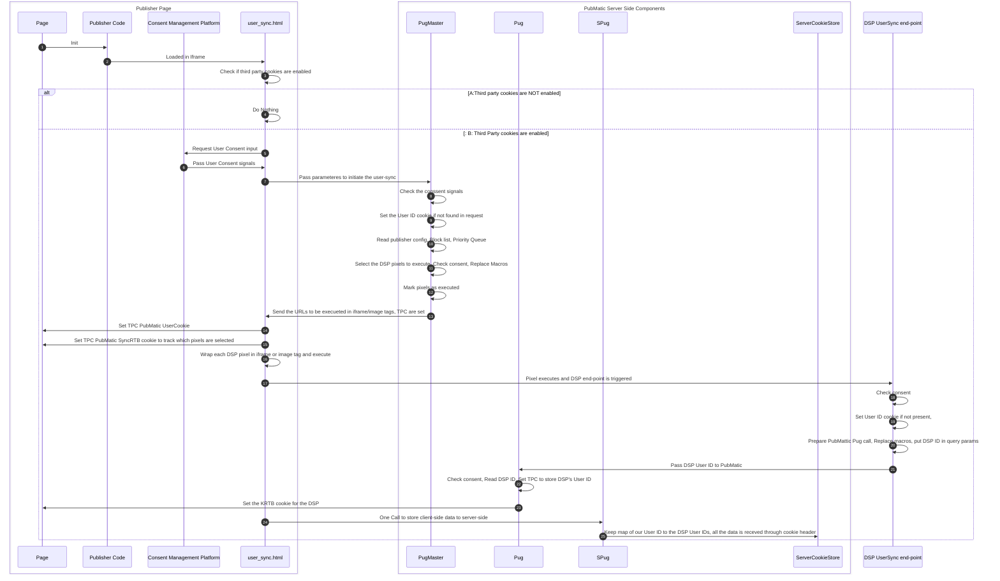

## PubMatic User Syncup: Iframe Based flow

```mermaid
sequenceDiagram
    autonumber
    box Publisher Page
    participant Page
    participant PubCode as Publisher Code
    participant CMP as Consent Management Platform
    participant UserSync as user_sync.html
    end
    box PubMatic Server Side Components
    participant PugM as PugMaster
    participant Pug
    participant SPug
    participant Aero as ServerCookieStore
    end
    participant DSP as DSP UserSync end-point

    Page->>PubCode: Init
    PubCode->>UserSync: Loaded in Iframe
    UserSync->>UserSync: Check if third party cookies are enabled
    alt A:Third party cookies are NOT enabled
        UserSync->>UserSync: Do Nothing
    else: B: Third Party cookies are enabled
        UserSync->>CMP: Request User Consent input
        CMP->>UserSync: Pass User Consent signals
        UserSync->>PugM: Pass parameteres to initiate the user-sync 
        PugM->>PugM: Check the conssent signals
        PugM->>PugM: Set the User ID cookie if not found in request
        PugM->>PugM: Read publisher config, Block list, Priority Queue
        PugM->>PugM: Select the DSP pixels to execute, Check consent, Replace Macros
        PugM->>PugM: Mark pixels as executed
        PugM->>UserSync: Send the URLs to be execueted in iframe/image tags, TPC are set
        UserSync->>Page: Set TPC PubMatic UserCookie
        UserSync->>Page: Set TPC PubMatic SyncRTB cookie to track which pixels are selected
        UserSync->>UserSync: Wrap each DSP pixel in iframe or image tag and execute
        UserSync->>DSP: Pixel executes and DSP end-point is triggered
        DSP->>DSP: Check consent
        DSP->>DSP: Set User ID cookie if not present, 
        DSP->>DSP: Prepare PubMattic Pug call, Replace macros, put DSP ID in query params
        DSP->>Pug: Pass DSP User ID to PubMatic
        Pug->>Pug: Check consent, Read DSP ID, Set TPC to store DSP's User ID
        Pug->>Page: Set the KRTB cookie for the DSP
        UserSync->>SPug: One Call to store client-side data to server-side
        SPug->>Aero: Keep map of our User ID to the DSP User IDs, all the data is receved through cookie header        
    end
    
    
```
