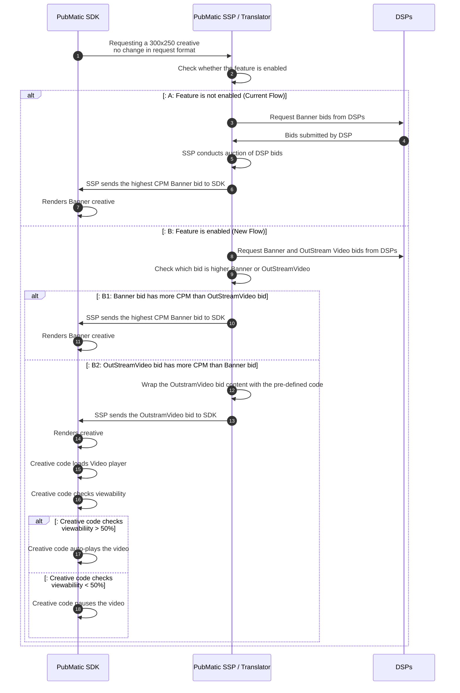

## SDK: Banner + OutStream Video

```mermaid
sequenceDiagram
    autonumber
    participant SDK as PubMatic SDK
    participant SSP as PubMatic SSP / Translator
    participant DSP as DSPs
    
    SDK->>SSP: Requesting a 300x250 creative <br/> no change in request format
    SSP->>SSP: Check whether the feature is enabled
    alt: A: Feature is not enabled (Current Flow)
      SSP->>DSP: Request Banner bids from DSPs
      DSP->>SSP: Bids submitted by DSP
      SSP->>SSP: SSP conducts auction of DSP bids
      SSP->>SDK: SSP sends the highest CPM Banner bid to SDK
      SDK->>SDK: Renders Banner creative
    else: B: Feature is enabled (New Flow)
      SSP->>DSP: Request Banner and OutStream Video bids from DSPs
      SSP->>SSP: Check which bid is higher Banner or OutStreamVideo
      alt: B1: Banner bid has more CPM than OutStreamVideo bid
        SSP->>SDK: SSP sends the highest CPM Banner bid to SDK
        SDK->>SDK: Renders Banner creative
      else: B2: OutStreamVideo bid has more CPM than Banner bid
        SSP->>SSP: Wrap the OutstramVideo bid content with the pre-defined code
        SSP->>SDK: SSP sends the OutstramVideo bid to SDK
        SDK->>SDK: Renders creative
        SDK->>SDK: Creative code loads Video player
        SDK->>SDK: Creative code checks viewability
        alt: Creative code checks viewabiliity > 50%
            SDK->>SDK: Creative code auto-plays the video
        else: Creative code checks viewabiliity < 50%
            SDK->>SDK: Creative code pauses the video
        end    
      end      
    end
    
```
