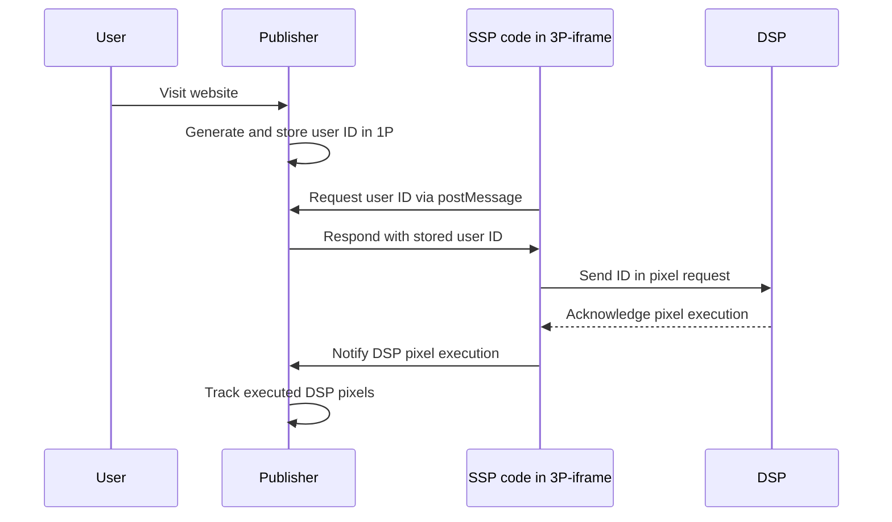

```mermaid
sequenceDiagram
    participant User
    participant Publisher
    participant SSP as SSP code in 3P-iframe 
    participant DSP
    
    User->>Publisher: Visit website
    Publisher->>Publisher: Generate and store user ID in 1P
    SSP->>Publisher: Request user ID via postMessage
    Publisher->>SSP: Respond with stored user ID
    SSP->>DSP: Send ID in pixel request
    DSP-->>SSP: Acknowledge pixel execution
    SSP->>Publisher: Notify DSP pixel execution
    Publisher->>Publisher: Track executed DSP pixels
```
