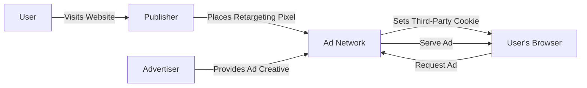
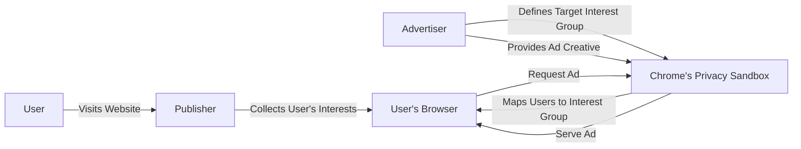

Cookie based user retargeting

```mermaid
graph LR  
  A[User] -- Visits Website --> B[Publisher]
  B -- Places Retargeting Pixel --> C[Ad Network]
  C -- Sets Third-Party Cookie --> D[User's Browser]
  E[Advertiser] -- Provides Ad Creative --> C
  D -- Request Ad --> C
  C -- Serve Ad --> D
```

Interest Group based user retargeting

```mermaid
graph LR
  A[User] -- Visits Website --> B[Publisher]
  B -- Collects User's Interests --> D[User's Browser]
  E[Advertiser] -- Defines Target Interest Group --> C[Chrome's Privacy Sandbox]
  C -- Maps Users to Interest Group --> D
  E -- Provides Ad Creative --> C
  D -- Request Ad --> C
  C -- Serve Ad --> D

```
